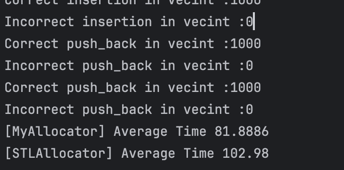

## Allocator using multi-size memory pool
The project implemented an allocator using memory pool strategy to speed up the speed of memory allocation.

Inorder to decrease memory fragmentation, a memory pool of different size (4, 8, 16, ...) are implemented. When allocating memory, the smallest memory pool that could fit the space will be chosen, for example, if a space of size 31 is needed, then the memory pool of size 32 will be used.

This implementation of allocator is slightly faster than the STL::Allocator (IN SMALL TEST CASES)

I also made some change to the performance test:

+ Random creation
+ Random resize
+ Random element assignment
+ Pop everything
+ Random creation after erase

## Note
You must compile it with C++ 17 since several features are used.

You MUST test the performance of the allocator in RELEASE mode.

## Reference

+ 侯捷 - The Annotated STL Sources

